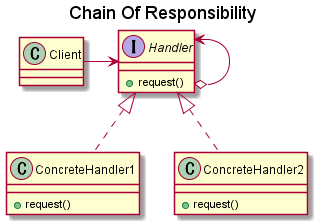
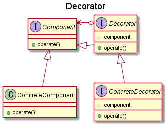
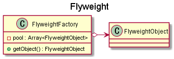

### GoFのデザインパターン 02


---

### 概要

- 4人のおっさんがまとめた設計・実装パターンカタログ
- OOP言語(C++やJava等)をベースに考えられている

---


### 今週のパターン

- Chain of Responsibility
- Decorator
- Flyweight

- 時間があったら
    - Builder
    - Abstrac Factory
    - Factory Method

---

### Chain of Responsibility(1)

- 業務のタライ回し




- 利用例
    - UIコンポーネントのコンテキストヘルプ
    - ログレベルの制御

---

### Chain of Responsibility(2)

```java
void request(arg) {
  if (自分が処理する条件) {
    // 処理
  } else if (next != null) {
    // 後続に処理を任せる
    next.request(arg);
  } else {
    // 処理不能
  }
}
```

---

### Decorator

- 機能を **動的に追加** する



---

### Flyweight

- インスタンスの再利用による省メモリ(リソース)
- 不変オブジェクトに適用
- 発展: コピーオンライト



