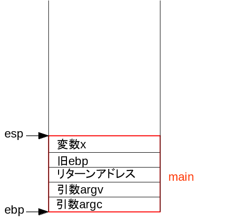
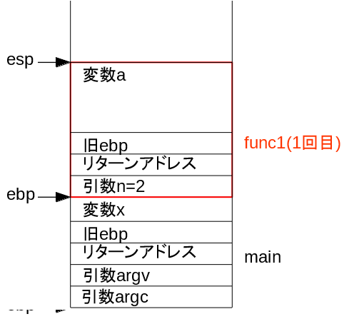
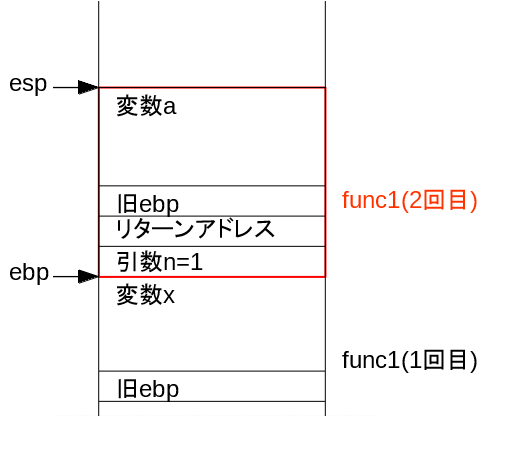
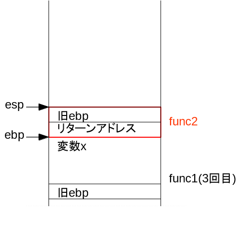
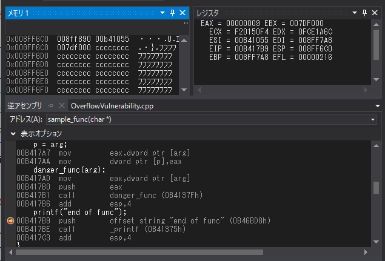

### プログラムが動く仕組み01 入門編

---

### レジュメ
1. CPUとメモリ
1. アセンブラ
1. 関数の仕組み
1. オーバーフロー脆弱性

---

### CPUの役割
- 命令の取り出しと解析
- オペランドの計算
- 命令実行
- 演算結果の格納

---

### レジスタ: 概要
- CPU内蔵の記憶回路
- メモリよりもずっと高速アクセス可能
- 以降、簡単のため32bitマシン前提
- 32bitマシンでは各レジスタも32bit

---

### レジスタ: 種類
- 汎用レジスタ
    - eax, ebx, ecx, edx
- インデクスレジスタ
    - esi, edi
- 特殊レジスタ
    - ebp, esp, eip
- フラグレジスタ(各1bit)
    - SF(サインフラグ), ZF(ゼロフラグ)など
- その他いろいろ

---

### アセンブラ

---

これから皆さんに少しだけアセンブラを覚えてもらいます

---

### アセンブラコード例
- 最初のmovがニーモニック≒命令
- 続くのがオペランド≒引数

```nasm
mov eax, ebx ; ebxの値をeaxに格納
```

---

### 転送命令: MOV
値を指定の場所に格納

```nasm
MOV eax, ebx     ; ebxの値をeaxに格納
MOV [esp+4], eax ; eaxの値をespが指すアドレスの4byte先に格納
```

---

### 演算命令: ADD
2値の和を第1オペランドに格納

```nasm
ADD eax, ebx     ; eaxとebxの和をeaxに格納
```

---

### 演算命令: CMP
2値を比較して結果によってフラグレジスタを変更

- ZF(ゼロフラグ)  : 結果が0ならフラグを立てる
- SF(サインフラグ): 結果が負値ならフラグを立てる

```nasm
CMP 1, 1; ZFが1, SFが0
CMP 2, 1; ZFが0, SFが0
CMP 1, 2; ZFが0, SFが1
```

---

### 条件付きジャンプ命令: JE
ZF=1のときジャンプ
つまり、2値の比較結果が同じならジャンプ

```nasm
CMP eax, ebx; eaxとebxが
JE L1       ; 等しければL1(アドレス)にジャンプ
```

---

プログラムを形作る基本が出揃った
- 格納
- 計算
- 条件分岐
- そしてループ

---

### 関数の仕組み
- コールスタック
- 引数
- 戻りアドレス

---

### コードとスタックの実例

---?code=f_stack.c
@[9-12](main関数)

---



---?code=f_stack.c
@[1-5](func1(1回目))

---



---?code=f_stack.c
@[1-5](func1(2回目))

---



---?code=f_stack.c
@[1-5](func1(3回目))

---


---?code=f_stack.c
@[6-8](func2)

---



---?code=f_stack.c
@[1-5](func1(3回目戻り))

---


---?code=f_stack.c
@[1-5](func1(2回目戻り))

---


---?code=f_stack.c
@[1-5](func1(1回目戻り))

---


---?code=f_stack.c
@[9-12](main関数(戻ってきた))

---


---


### バッファオーバーフローの脆弱性

---

### 悪事を企む様



---?code=overflow.c

バッファオーバーフローを利用


### おまけ

---?code=rewrite.c

動的なコードの書き換え


### では、皆さん良いハッカーライフを！
