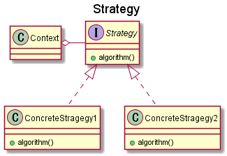

### GoFのデザインパターン 01

---

### 概要

- 4人のおっさんがまとめた設計・実装パターンカタログ
- OOP言語(C++やJava等)をベースに考えられている

---

### モチベーション

- 設計パターンを学習する
- 例を通して抽象的な設計の発想方法を鍛える
    - **ほどほどに** 抽象的なので教材に良い

---

### アンチ・モチベーション

- 古い
- 今となってはあまり使わないものも多い
- というか直接使うケースは少ないと思う

---

### 方針

- 使用頻度の高いもの、学習価値の高そうなものをピックアップして紹介
- 覚えるより、考え方の訓練

---

### 今週のパターン

- Strategy
- Observer
- Composite

---

### Strategy

- アルゴリズムの動的(≒実行時)な選択

---

### Observer

- イベント処理
- Pub-Subモデル

---

### Composite

- ツリー構造の再帰的なデータ構造を表現するのに使用
- 例: ディレクトリとファイル

---

### 発展

より抽象度の高いパターン

- エンタープライズアプリケーションアーキテクチャパターン(マーチン・ファウラー)
- ドメイン駆動設計(エリック・エヴァンス)
